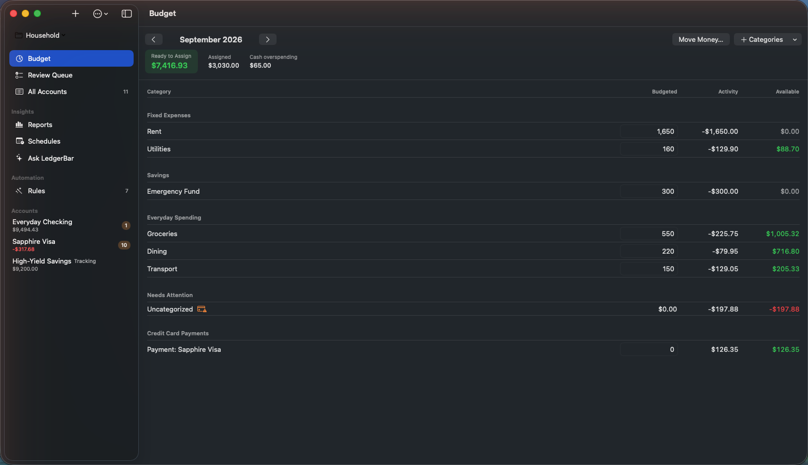

# LedgerBar

A local-first, zero-based envelope budgeting app for macOS. Native SwiftUI,
lives in your menu bar, stores everything in one local SQLite file, and can
import read-only bank data through SimpleFIN Bridge. No telemetry, no
LedgerBar server, no cloud.

<!-- Screenshot slot: capture from a synthetic-data smoke run only (see
     docs/DEVELOPMENT.md "Disposable smoke test"), save as
     docs/images/budget-grid.png, add the path to PUBLIC_FILES.txt, then
     uncomment:
<p align="center">
  
</p>
-->

## Features

- **Envelope budgeting** — a monthly grid of Budgeted / Activity / Available
  per category with inline assignment and an atomic **Move Money** flow.
  Ready to Assign turns red the moment you over-assign.
- **Menu-bar summary** — the current month's Ready to Assign, assigned
  total, and activity at a glance, with needs-attention counts and one-click
  **Sync Now**.
- **Bank import via SimpleFIN** *(optional)* — connect once with a
  single-use SimpleFIN Bridge Setup Token. Posted transactions and balances
  sync on demand, and automatically at most once a day (re-checked on
  launch, activation, and wake). The app is fully usable with manual entry
  alone.
- **Transaction register** — manual entry, search, and workflow filters
  (Needs Category, Staged, Unapproved); approve/clear flags; guarded edit
  and delete. Imported amounts stay provider-owned, and imported rows are
  voided rather than silently merged or destroyed.
- **Review Queue** — every sync conflict and balance discrepancy becomes an
  explicit decision (keep local, accept remote, void, or audited
  adjustment). Nothing is auto-resolved behind your back.
- **Credit cards, done strictly** — negative-debt convention, an automatic
  payment category per card, and per-category credit-overspending tracking.
- **Transfers** — manual transfers between accounts (on- and off-budget),
  plus explicit pairing of two imported rows as one transfer.
- **Auto-categorization by exact payee** — categorize a payee once and
  sign-compatible future imports follow it.
- **Reconciliation** — statement-based reconcile with one deterministic
  adjustment, and undo for the most recent reconciliation.
- **Verified backups** — a consistent SQLite snapshot, integrity-checked
  before it is written to the destination you choose.
- **Split transactions** — allocate one purchase across several categories.
  The bank row stays one row; only its budget allocation changes, and
  card refunds can target a single component.
- **Rules** — deterministic automation that renames payees, categorizes,
  annotates, flags, or splits imported transactions as they arrive, with
  a preview before any retroactive run and an audit note on every change.
  The bank's original description is always kept.
- **File import** — CSV (with a saved column mapping), OFX, and QFX
  exports, run through the same review as bank sync: certain duplicates
  are skipped, near matches are shown for you to decide, nothing merges.
- **Reports** — spending by category, group, payee, or account; spending
  over time; income vs spending; net worth; budget vs actual — with
  explicit accounting semantics, period comparison, saved definitions,
  and the transactions behind every number.
- **Schedules** — expected bills, income, and card payments. Imports are
  matched to them (ambiguous cases go to the Review Queue), overdue
  expectations stay visible, and projected balances are labeled as such.
  Nothing is entered automatically.
- **Multiple budgets** — independent budgets in one database (personal,
  household, sandbox) with a switcher, archive, export/import, and
  nothing shared between them.
- **Ask LedgerBar** *(optional, local-only)* — natural-language questions
  answered from the ledger through a fixed set of typed tools. Works with
  a local model server on this Mac (Ollama or any OpenAI-compatible server
  on 127.0.0.1; remote endpoints are refused by construction) and, without
  any model, still answers common questions deterministically. Changes it
  drafts need an explicit Apply. See [docs/LOCAL-AI.md](docs/LOCAL-AI.md).

## Requirements

- macOS 15 or later.
- To build: a Swift 6 toolchain. Xcode Command Line Tools are enough for
  the executable and the local `.app`; full Xcode and XcodeGen 2.46.0 are
  needed only for the signed, sandboxed bundle (see
  [docs/DEVELOPMENT.md](docs/DEVELOPMENT.md)).
- For bank sync (optional): a Setup Token from your
  [SimpleFIN Bridge](https://bridge.simplefin.org) account. Access is
  read-only; LedgerBar can never move money.

## Install

No prebuilt binaries are distributed — you build LedgerBar from this
repository. For an app that reads your bank data, that is deliberate: every
line that touches your money is in this repo for you to read first.

```bash
git clone <repository-url> LedgerBar
cd LedgerBar
./Tools/install-local-app.sh
open /Applications/LedgerBar.app
```

If `/Applications` is not writable, install into your user Applications
folder instead: `LEDGERBAR_INSTALL_DIR="$HOME/Applications"
./Tools/install-local-app.sh`. For a menu-bar-only bundle without the Dock
icon, use `./Tools/build-local-app.sh` and launch
`.build/Local/LedgerBar.app` directly.

Both bundles carry the LedgerBar icon: an "LB" monogram built from
ledger-like strokes. The source drawing is `Design/AppIcon.svg`;
`swift Tools/render-app-icon.swift LedgerBar/Resources/Assets.xcassets`
regenerates the asset catalog from it with no third-party tools, and the
menu-bar glyph is drawn from the same geometry at runtime.

First launch runs onboarding: pick the budget currency, time zone, and
first budget month. All three are fixed once the budget is created.

One honest limitation of the self-built app: it is ad-hoc signed, which is
fully sufficient for budgeting, but the SimpleFIN credential requires the
app's Keychain access group, which ad-hoc signing cannot provide. LedgerBar
preflights the Keychain and fails closed **before** your single-use Setup
Token would be spent. Live bank sync therefore needs the development-signed
build described in [docs/DEVELOPMENT.md](docs/DEVELOPMENT.md).

## Using the app

The menu-bar popover shows the month at a glance; **Open LedgerBar** opens
the full window with the budget grid, account registers, Reports,
Schedules, Rules, and the Review Queue. The budget switcher at the top of
the sidebar changes the active budget. The gear opens Settings (SimpleFIN,
Backup).

When connecting SimpleFIN, a Setup Token that targets anything other than
the official host is rejected locally first; the exact host is shown and
sync proceeds only if you explicitly choose **Trust Host & Retry**. Setup
Tokens are never written to disk, and the Access URL credential lives only
in the Keychain.

## Status and scope

LedgerBar is a personal project. v1 is deliberately narrow: correctness of
the ledger and budget engine over feature breadth. The engine is gated by a
deterministic replay model and a conservation oracle exercised by the test
suite before any UI work.

Current v1 boundaries you should know before moving your budget here:

- One currency per budget; currency, time zone, and first month are fixed
  at creation.
- One SimpleFIN connection per budget (it may expose many institutions and
  accounts).
- Only the current month can be assigned or reallocated; past and future
  months are read-only (past months can be closed and reopened).
- The app ships with a starter set of category groups and categories, plus
  an automatic payment category per credit card. Categories and groups can
  be added and renamed from the budget grid, and categories can be hidden
  (archived — history is kept, never deleted) and unhidden via the row's
  context menu. Reordering categories and groups is not yet supported.
- Restore is manual (documented below); there is no restore UI.
- Not yet: QIF import, CSV export, goals, multi-currency, cloud sync, iOS.
  The design behind splits, rules, file import, reports, schedules, and
  multiple budgets is in [docs/DESIGN.md](docs/DESIGN.md).
- Pending bank transactions are not imported; SimpleFIN history is roughly
  90 days (a provider constraint).
- Credit cards cannot go positive in v1 — overpayments and cash advances
  are rejected or staged for review.

## Backup and manual restore

Settings → Backup creates a consistent snapshot via the GRDB backup API,
verifies it with `PRAGMA integrity_check`, and only then copies it to your
chosen destination. The backup is **unencrypted SQLite**; protect the
destination (FileVault, access controls).

Restore is manual in v1. A development-signed sandboxed app uses
`~/Library/Containers/com.ledgerbar.app/Data/Library/Application Support/LedgerBar/`;
the unsandboxed ad-hoc/manual bundle uses
`~/Library/Application Support/LedgerBar/`.

1. Quit LedgerBar.
2. In the appropriate LedgerBar Application Support directory above, remove
   `ledgerbar.sqlite`, `ledgerbar.sqlite-wal`, and `ledgerbar.sqlite-shm`.
3. Copy your backup file to `ledgerbar.sqlite` in that same directory.
4. Relaunch LedgerBar. The app rebuilds its observations from the replaced
   database on launch.

## Security posture

- SimpleFIN Setup Tokens are single-use, never persisted, and claimed only
  against `bridge.simplefin.org` or a host you explicitly trust.
- The Access URL credential lives in one Keychain item
  (`WhenUnlockedThisDeviceOnly`, non-synchronizable); SQLite stores only a
  reference. Redirects are refused; every request is validated against the
  approved host and exact path allowlist; errors and logs are redacted.
- The local database is unencrypted and relies on FileVault at rest.

## Building from source

With Command Line Tools only:

```bash
swift test               # headless correctness gate — must be green
swift build              # builds LedgerCore + the LedgerBar executable
swift run LedgerBar      # runs the real SwiftUI app (menu bar + window)
```

`SPEC.md` is the governing specification. Repository layout, database
paths, the SimpleFIN capture gate, the signed native gates, and the
publication workflow are documented in
[docs/DEVELOPMENT.md](docs/DEVELOPMENT.md).

## Contributing and support

Bug reports and questions are welcome as issues. The v1 scope above is
intentional, and the engine is gated by a strict correctness suite — if you
want to propose a change, please open an issue to discuss it before
writing code.

## License

LedgerBar is licensed under the Apache License, Version 2.0. See
[LICENSE](LICENSE).

LedgerBar's third-party dependencies remain under their respective upstream
licenses. Their exact versions, source revisions, and license texts are
recorded in [THIRD_PARTY_NOTICES.md](THIRD_PARTY_NOTICES.md), with package
resolution recorded in `Package.swift` and `Package.resolved`.

## Public source transparency

This repository is published through an explicit allowlist:
`PUBLIC_FILES.txt` names every published file, and
`Tools/check-public-files.sh` verifies — fail-closed — that nothing
generated, private, or credential-bearing is included in the tree or in
reachable history. The maintainer workflow is described in
[docs/DEVELOPMENT.md](docs/DEVELOPMENT.md).
