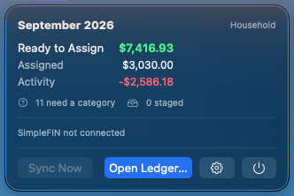
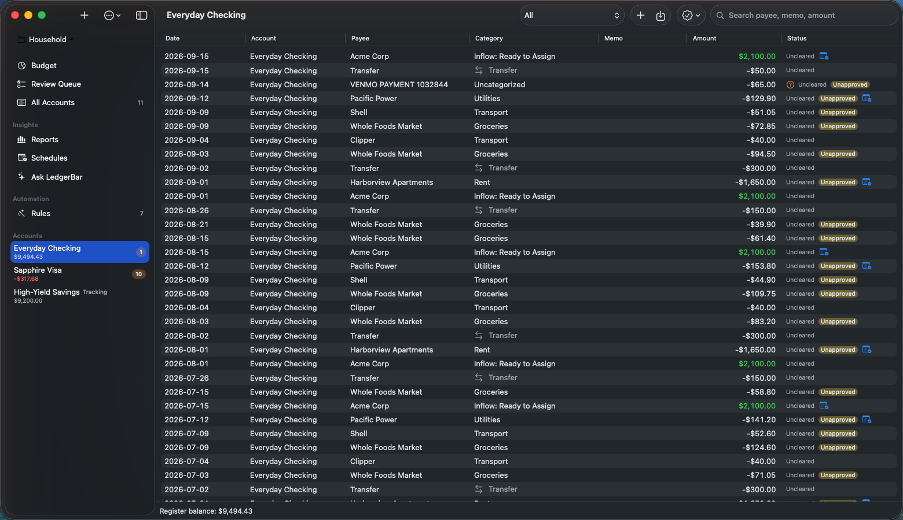
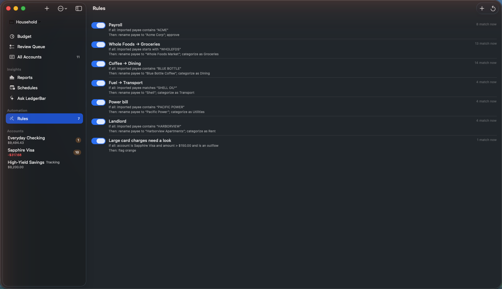
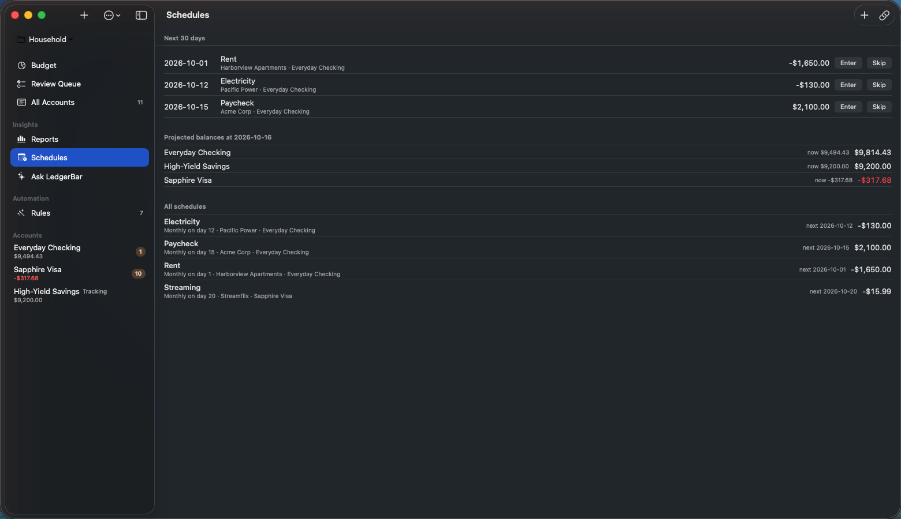
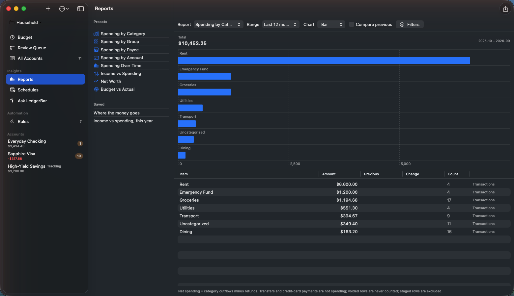
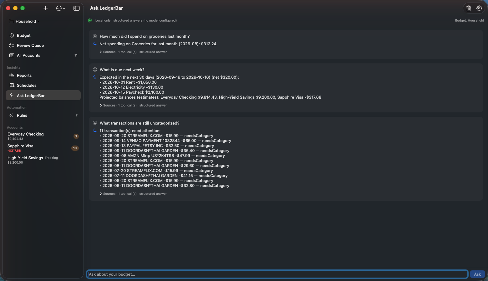

#  LedgerBar

**Local-first envelope budgeting for macOS, from your menu bar.**

LedgerBar keeps a zero-based budget in one SQLite file on your Mac. It can
pull read-only bank data through SimpleFIN Bridge or import the files your
bank exports, and it never sends your finances anywhere: no telemetry, no
LedgerBar server, no cloud, and an optional assistant that only talks to a
model running on this machine.

<p align="center">
  
</p>

<p align="center">
  
</p>

*Screenshots show a synthetic demo budget, not real bank data.*

## Where to look

| I want to… | Read |
| --- | --- |
| Install and use LedgerBar | This page: [Features](#features), [Getting started](#getting-started), [Your data](#your-data), [Scope and limitations](#scope-and-limitations) |
| Understand the local assistant and its privacy boundary | [docs/LOCAL-AI.md](docs/LOCAL-AI.md) |
| Build, test, or change the code | [CONTRIBUTING.md](CONTRIBUTING.md), then [docs/DEVELOPMENT.md](docs/DEVELOPMENT.md) |
| Know exactly how the accounting engine behaves | [SPEC.md](SPEC.md) (governing specification) |
| See why splits, rules, reports, schedules, and budgets are built the way they are | [docs/DESIGN.md](docs/DESIGN.md) |
| Check licenses | [LICENSE](LICENSE), [THIRD_PARTY_NOTICES.md](THIRD_PARTY_NOTICES.md) |

## Features

### Budgeting

- **Envelope budgeting.** A monthly grid of Budgeted / Activity / Available
  per category with inline assignment and an atomic **Move Money** flow.
  Ready to Assign turns red the moment you over-assign.
- **Menu-bar summary.** The current month's Ready to Assign, assigned total,
  and activity at a glance, with needs-attention counts and one-click
  **Sync Now**.
- **Credit cards, done strictly.** Negative-debt convention, an automatic
  payment category per card, and per-category credit-overspending tracking.
- **Transfers.** Manual transfers between on- and off-budget accounts, plus
  explicit pairing of two imported rows as one transfer.
- **Multiple budgets.** Independent budgets in one database (personal,
  household, sandbox) with a switcher, archive, export/import, and nothing
  shared between them.

### Getting transactions in

- **Bank sync via SimpleFIN** *(optional)*. Connect once with a single-use
  SimpleFIN Bridge Setup Token. Posted transactions and balances sync on
  demand and automatically at most once a day. Access is read-only;
  LedgerBar can never move money. The app is fully usable with manual entry
  alone.
- **File import.** CSV (with a saved column mapping), OFX, and QFX exports go
  through the same review as bank sync: certain duplicates are skipped, near
  matches are shown for you to decide, and nothing merges silently.
- **Transaction register.** Manual entry, search, workflow filters (Needs
  Category, Staged, Unapproved), approve and clear flags, guarded edit and
  delete. Imported amounts stay provider-owned, and imported rows are voided
  rather than merged or destroyed.
- **Split transactions.** Allocate one purchase across several categories.
  The bank row stays one row, and card refunds can target a single
  component.
- **Review Queue.** Every sync conflict, balance discrepancy, and ambiguous
  schedule match becomes an explicit decision. Nothing is auto-resolved
  behind your back.
- **Reconciliation.** Statement-based reconcile with one deterministic
  adjustment, and undo for the most recent reconciliation.

### Automation and insight

- **Rules.** Deterministic automation that renames payees, categorizes,
  annotates, flags, or splits imported transactions as they arrive, with a
  preview before any retroactive run and an audit note on every change.
  The bank's original description is always kept.
- **Auto-categorization by exact payee.** Categorize a payee once and
  sign-compatible future imports follow it.
- **Schedules.** Expected bills, income, and card payments. Imports are
  matched to them, overdue expectations stay visible, and projected
  balances are labeled as projections. Nothing is entered automatically.
- **Reports.** Spending by category, group, payee, or account; spending over
  time; income vs spending; net worth; budget vs actual. Explicit accounting
  semantics, period comparison, saved definitions, and the transactions
  behind every number.
- **Ask LedgerBar** *(optional, local-only)*. Natural-language questions
  answered from your ledger through a fixed set of typed tools. Works with a
  model server on this Mac (Ollama or any OpenAI-compatible server on
  127.0.0.1; remote endpoints are refused by construction) and, without any
  model, still answers common questions deterministically. Changes it drafts
  need an explicit **Apply**.

### A closer look

| | |
| --- | --- |
| [](docs/images/register.png) **Register.** Imported and manual rows side by side, with cleared and approval status. | [](docs/images/rules.png) **Rules.** Each rule states its conditions and actions in plain words and shows how often it matched. |
| [](docs/images/schedules.png) **Schedules.** What is due in the next 30 days, projected balances, and every recurring item. | [](docs/images/reports.png) **Reports.** Spending by category over the last twelve months, with the transactions behind each row. |
| [](docs/images/assistant.png) **Ask LedgerBar.** Grounded answers from your own ledger, here with no model configured. | |

### Safety net

- **Verified backups.** A consistent SQLite snapshot, integrity-checked
  before it is written to the destination you choose.
- **No silent history changes.** Imports are auditable, deletions are
  guarded, and closed months are read-only.

## Getting started

### Requirements

- macOS 15 or later.
- A Swift 6 toolchain to build the app. Xcode Command Line Tools are enough
  for everyday use; full Xcode is needed only for live bank sync (see
  below).
- For bank sync *(optional)*: a Setup Token from your
  [SimpleFIN Bridge](https://bridge.simplefin.org) account.

### Install

No prebuilt binaries are distributed. You build LedgerBar from this
repository, which for an app that reads your bank data is deliberate: every
line that touches your money is here for you to read.

```bash
git clone https://github.com/aycibatuhan/LedgerBar.git
cd LedgerBar
./Tools/install-local-app.sh
open /Applications/LedgerBar.app
```

If `/Applications` is not writable, install into your user Applications
folder instead:

```bash
LEDGERBAR_INSTALL_DIR="$HOME/Applications" ./Tools/install-local-app.sh
```

For a menu-bar-only bundle without a Dock icon, run
`./Tools/build-local-app.sh` and launch `.build/Local/LedgerBar.app`.

**Bank sync needs a signed build.** The self-built app is ad-hoc signed,
which is fully sufficient for budgeting, but the SimpleFIN credential
requires the app's Keychain access group, which ad-hoc signing cannot
provide. LedgerBar checks this and fails closed *before* your single-use
Setup Token would be spent. To sync live bank data, build the
development-signed app as described in
[docs/DEVELOPMENT.md](docs/DEVELOPMENT.md); it needs full Xcode and a free
Apple Developer account.

### First launch

Onboarding asks for a budget name, currency, time zone, and first budget
month. Currency, time zone, and first month are fixed once the budget is
created.

### Using the app

The menu-bar popover shows the month at a glance. **Open LedgerBar** opens
the full window with the budget grid, account registers, Reports,
Schedules, Rules, Ask LedgerBar, and the Review Queue. The budget switcher
at the top of the sidebar changes the active budget. The gear opens
Settings (SimpleFIN, Backup, Assistant).

When connecting SimpleFIN, a Setup Token that targets anything other than
the official host is rejected locally first. The exact host is shown, and
sync proceeds only if you explicitly choose **Trust Host & Retry**.

To use Ask LedgerBar with a model, install [Ollama](https://ollama.com),
pull a chat model, and point Settings → Assistant at `127.0.0.1`. Without a
model the assistant still answers common questions from the ledger
deterministically.

## Your data

### Where it lives

Everything is in one SQLite database. The development-signed sandboxed app
uses
`~/Library/Containers/com.ledgerbar.app/Data/Library/Application Support/LedgerBar/`;
the ad-hoc bundle uses `~/Library/Application Support/LedgerBar/`. The
database is unencrypted and relies on FileVault at rest.

Before a schema upgrade, LedgerBar writes a verified copy of the previous
database next to it (for example `ledgerbar.before-v10.sqlite`).

### Backup

Settings → Backup creates a consistent snapshot, verifies it with an
integrity check, and only then copies it to the destination you choose. The
backup is **unencrypted SQLite**; protect the destination.

### Manual restore

Restore is manual in v1.

1. Quit LedgerBar.
2. In the Application Support directory above, remove `ledgerbar.sqlite`,
   `ledgerbar.sqlite-wal`, and `ledgerbar.sqlite-shm`.
3. Copy your backup file to `ledgerbar.sqlite` in that directory.
4. Relaunch LedgerBar.

### Privacy and security

- Nothing leaves your Mac except read-only requests to SimpleFIN Bridge,
  and only if you connect it.
- SimpleFIN Setup Tokens are single-use, never written to disk, and claimed
  only against `bridge.simplefin.org` or a host you explicitly trust. The
  Access URL credential lives in one Keychain item
  (`WhenUnlockedThisDeviceOnly`, non-synchronizable). Redirects are refused,
  every request is validated against an exact allowlist, and logs are
  redacted.
- Ask LedgerBar connects only to loopback addresses. The model never gets
  database access, only typed tools; transaction text is treated as data,
  never as instructions; and conversations are stored locally and can be
  cleared. Details in [docs/LOCAL-AI.md](docs/LOCAL-AI.md).

## Scope and limitations

LedgerBar is a personal project. v1 favors correctness of the ledger and
budget engine over feature breadth. Before moving your budget here, know
that:

- One currency per budget; currency, time zone, and first month are fixed
  at creation.
- One SimpleFIN connection per budget (it may expose many institutions and
  accounts). Pending bank transactions are not imported, and SimpleFIN
  history is roughly 90 days (a provider constraint).
- Only the current month can be assigned or reallocated; past and future
  months are read-only (past months can be closed and reopened).
- Categories and groups can be added, renamed, and hidden (history is kept),
  but not yet reordered.
- Credit cards cannot go positive in v1; overpayments and cash advances are
  rejected or staged for review.
- Restore is manual; there is no restore UI.
- Not yet: QIF import, CSV export, goals, multi-currency, cloud sync, iOS.

## Contributing

Bug reports and questions are welcome as issues. The v1 scope is
intentional and the engine is gated by a strict correctness suite, so
please open an issue to discuss a change before writing code.
[CONTRIBUTING.md](CONTRIBUTING.md) covers building, testing, the design
documents, the app icon, and how this repository is published.

## License

LedgerBar is licensed under the Apache License, Version 2.0. See
[LICENSE](LICENSE). Third-party dependencies remain under their upstream
licenses, recorded in [THIRD_PARTY_NOTICES.md](THIRD_PARTY_NOTICES.md).
